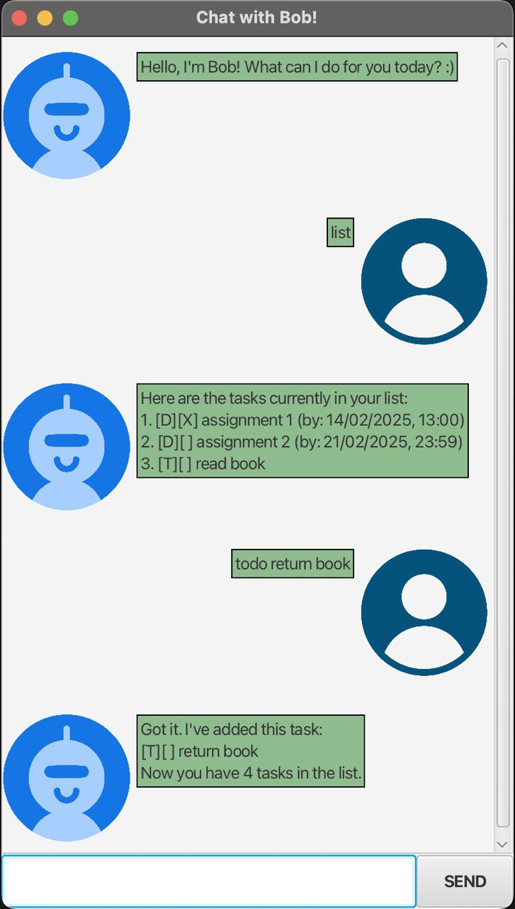

# Bob User Guide



Do you have way too many tasks to complete? Are you finding it difficult to keep track of all of them?

Introducing... Bob! :partying_face: Bob is an easy-to-use chatbot that keeps track of your to-do list for you!

Table of Contents
+ [Quick Start](#quick-start)
+ [Features](#features)
  + [Adding todo tasks](#adding-tasks-with-no-deadlines)
  + [Adding tasks with deadlines](#adding-tasks-with-a-deadline)
  + [Adding events](#adding-events)
  + [List](#list-all-tasks)
  + [Find](#find-tasks-using-search-key)
  + [Mark as completed](#mark-task-as-completed)
  + [Mark as uncompleted](#mark-task-as-uncompleted)
  + [Delete](#delete-a-specific-task)
  + [Check for duplicates](#check-for-duplicates)
  + [Remove duplicates](#remove-duplicates)
  + [Closing the program](#closing-the-program)
+ [Data File in Hard Disk](#data-file-in-hard-disk)
  + [Format used to save tasks](#format-in-which-tasks-are-saved)
  + [Editing the data file](#editing-the-data-file)
+ [Command Summary](#command-summary)

## Quick Start
1. Install `Java 17` or above on your computer. **For Mac users**, please use precise JDK specified
   [here](https://se-education.org/guides/tutorials/javaInstallationMac.html).
2. Download the latest `bob.jar` file [here](https://github.com/ambertan77/ip/releases).
3. Copy the file to the folder you want to use as the home folder for Bob.
4. Open a command terminal and `cd` into the folder that the jar file is in.
5. Use the `java -jar bob.jar` command to run the application. 
6. A GUI similar to the product screenshot above will appear after a few seconds. A sub-folder called "data" should be 
   created in the home folder containing the jar file. Inside this sub-folder, there should be a data.txt file.
7. Type the command you want to execute in the text bar at the bottom of the application. 
   Press the **SEND** button or press the Enter key to execute it.
8. Refer to the Feature list below for all the commands that Bob currently supports.

## Features
This section details the list of commands that Bob is currently able to execute. 
If any error has occurred due to wrong input format, Bob will return a message detailing what has gone wrong.
The command that you have input will not be executed.

>[!NOTE]
> Note about the command format:
> 
> Words in `UPPER_CASE` are the parameters supplied by you. For example, if the command format is `todo DESCRIPTION`, 
> then `DESCRIPTION` should be replaced by whatever the description of your task is, such as `todo exercise`.
### Adding tasks with no deadlines

Adds tasks which are not time-sensitive.

Format: `todo DESCRIPTION`

Examples: 
+ `todo exercise`
+ `todo read book`

If executed successfully, Bob will return a output
```
Got it. I've added this task:
[T][ ] DESCRIPTION
Now you have NUMBER_OF_TASKS in the list.
```
where the `NUMBER_OF_TASKS` is the integer showing the number of tasks currently in your list.

### Adding tasks with a deadline

Adds tasks which have to be completed by a specific deadline.

Format: `deadline DESCRIPTION /by DD-MM-YYYY HH:MM`
+ The date and time must be in the format specified above.
+ The time should be in the 24-hour clock format.

Examples:
+ `deadline assignment 1 /by 21-02-2025 23:59`
+ `deadline submit quiz /by 17-03-2025 16:00`

If executed successfully, Bob will return a output
```
Got it. I've added this task:
[D][ ] DESCRIPTION (by: DD-MM-YYYY HH:MM)
Now you have NUMBER_OF_TASKS in the list.
```
where the `NUMBER_OF_TASKS` is the integer showing the number of tasks currently in your list.

### Adding events

Adds events, which have a specific start and end time.

Format: `event DESCRIPTION /from DD-MM-YYYY HH:MM /to DD-MM-YYYY HH:MM`
+ All dates and times must be in the format specified above.
+ The time should be in the 24-hour clock format.

Examples:
+ `event consult /from 23-02-2025 15:30 /to 23-02-2025 17:00`
+ `event student camp /from 01-06-2025 08:00 /to 03-06-2025 20:00`

If executed successfully, Bob will return a output
```
Got it. I've added this task:
[E][ ] DESCRIPTION (from DD-MM-YYYY HH:MM to DD-MM-YYYY HH:MM)
Now you have NUMBER_OF_TASKS in the list.
```
where the `NUMBER_OF_TASKS` is the integer showing the number of tasks currently in your list.

### List all tasks

Lists all tasks, deadlines and events that have been added into the task list.

Format: `list`

### Find tasks using search key

Finds all the tasks that partially or fully matches the search key provided.

Format: `find SEARCH_KEY`

Examples:
+ `find assignment`
+ `find submit quiz`

The expected output is a list of all items in the task list that contains the search key.

### Mark task as completed

Marks a task as completed.

Format: `mark INDEX`
+ Marks the task at specified `INDEX` as done.
+ `INDEX` refers to the index number shown in the displayed task list.
+ `INDEX` must be a positive integer, with a value less than the number of items in the task list.
+ Marking an `INDEX` that is already a completed task will not give an error.

Example:
+ `list` followed by `mark 2` will mark the 2nd task on the list as completed.

If executed successfully, Bob will return an output with `[X]` as the second square bracket 
(just before the description of the task).

### Mark task as uncompleted

Marks a task as uncompleted.

Format: `unmark INDEX`
+ Marks the task at specified `INDEX` as undone.
+ `INDEX` refers to the index number shown in the displayed task list.
+ `INDEX` must be a positive integer, with a value less than the number of items in the task list.
+ Marking an `INDEX` that is already a uncompleted task will not give an error.

Example:
+ `list` followed by `unmark 2` will mark the 2nd task on the list as not completed.

If executed successfully, Bob will return an output with `[ ]` as the second square bracket
(just before the description of the task).

### Delete a specific task

Deletes a task in the task list.

Format: `delete INDEX`
+ Deletes the task at specified `INDEX`.
+ `INDEX` refers to the index number shown in the displayed task list.
+ `INDEX` must be a positive integer, with a value less than the number of items in the task list. 

Example:
+ `list` followed by `delete 2` will delete the 2nd task on the list.

If executed successfully, commanding `list` again will show the updated task list, which should no longer shows the 
deleted task. The number of tasks in the task list will also decrease by one.

### Check for duplicates

Checks for any duplicates in the task list. 

Format: `check duplicates`

For two tasks to be considered duplicates, the following must be the same:
+ task description
+ deadline (if any)
+ start date and time (if any)
+ end date and time (if any)
+ type of task (todo/deadline/event)
+ whether the task has been completed

If executed successfully and no duplicates have been found, Bob will output: `No duplicates in list! :)`

If executed successfully and duplicated have been found, Bob will output: `Duplicates exist. Type 'remove duplicates' 
to remove all duplicates in list.`

### Remove duplicates

Removes duplicated tasks in the list, so that every item is unique. 

Format: `remove duplicates`

If this command is executed successfully when there are no duplicates found, Bob will output: `No duplicates found.`

If this command is executed successfully when there are duplicates in the task list, Bob will output: `All duplicates 
have been removed.` Commanding `list` again will show the updated list of tasks, which only contains unique tasks.

### Closing the program

Closes the running application. 

You can close the application by clicking on the :x: button at the top of the application, just like how you would 
close any other application. To get the exit message from Bob, command `bye`.
+ Note that the `bye` command does not automatically close the application.

## Data file in hard disk

The task list will be saved inside a file on your hard disk. In the folder containing the `bob.jar` file, a sub-folder 
called `data` will be created and will contain a `data.txt` file. The most updated task list will be saved here. 

When you re-run the `bob.jar` file and command `list`, Bob will output the all the tasks in the `data.txt` file.

### Format in which tasks are saved
One line represents information about one specific task. The different attributes of the task are separated by a slash.
Attributes are saved in the order of:
1. Type of task, denoted by a `D` (for deadline), `T` (for todo) or `E` (for event).
2. Whether the task is completed, denoted by `1` (for completed) or `0` (for uncompleted).
3. Description of the task.
4. Deadline of the task (for tasks with deadline only) OR Start time of the event (for events only).
5. End time of the event (for events only).

All dates and times are saved in the format: `DD/MM/YYYY, HH:MM`

Example: 
```
D / 1 / assignment 1 / 14/02/2025, 13:00
T / 0 / return book
E / consult / 17-03-2025, 09:00 / 18/03/2025, 10:00
```

### Editing the data file
Using a text editor, open and edit the `data.txt` file. 
Use the format specified above if you are editing or adding new tasks. 

## Command Summary
| Command                | Format                                                          |
|------------------------|-----------------------------------------------------------------|
| Add todo task          | `todo DESCRIPTION`                                              |
| Add task with deadline | `deadline DESCRIPTION /by DD-MM-YYYY HH:MM`                     |
| Add event              | `event DESCRIPTION /from DD-MM-YYYY HH:MM /to DD-MM-YYYY HH:MM` |
| List                   | `list`                                                          |
| Find                   | `find SEARCH_KEY`                                               |
| Mark as completed      | `mark INDEX`                                                    |
| Mark as uncompleted    | `unmark INDEX`                                                  |
| Delete                 | `delete INDEX`                                                  |
| Check for duplicates   | `check duplicates`                                              |
| Remove duplicates      | `remove duplicates`                                             |